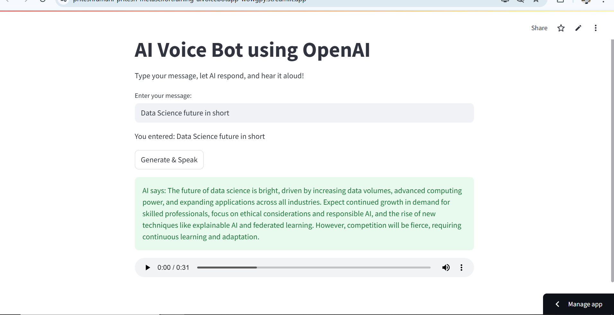

# 🎙️ AI Voice Bot using Gemini API

This project is a simple yet powerful AI Voice Bot built using **Streamlit**. It takes user text input, generates an AI-powered response through **Google's Gemini API**, and converts the response into speech using **gTTS (Google Text-to-Speech)**.

Developed as part of my **Data Science Internship at Meta Scifor Technologies**.

---

## 📦 Features

- 🔐 Securely manages API keys via a `.env` file
- 🤖 AI-generated text response using Google's **Gemini API**
- 🔊 Converts AI replies into speech using **gTTS**
- 🌐 Interactive and clean UI using **Streamlit**

---

## 📁 Project Structure

```

📦 ai-voice-bot/
├── app.py               # Main Streamlit application
├── .env                 # API keys (ignored by Git)
├── .gitignore           # Ignore .env and other unnecessary files
├── requirements.txt     # Project dependencies
└── README.md            # Project documentation

```

---

## 🔐 API Key Management

1. Create a `.env` file in your project root:

```

GEMINI\_API\_KEY=your\_actual\_gemini\_api\_key

```

2. Ensure `.gitignore` includes:

```

.env

````

This keeps your API key safe and prevents it from being pushed to GitHub.

---

## 🚀 How to Run

1. Install the required dependencies:

```bash
pip install -r requirements.txt
````

2. Run the Streamlit app:

   ```bash
   streamlit run app.py
   ```

---

## 📜 Dependencies

* streamlit
* google-generativeai
* gTTS
* python-dotenv

---

## 📸 Preview



---

## ✨ Credits

Built with 💙 as part of my **Data Science Internship at Meta Scifor Technologies**.

---

## 📌 Notes

* Always keep your `.env` file private and listed inside `.gitignore`.
* You can extend this app by adding speech-to-text input, chatbot history, or a more styled UI.
